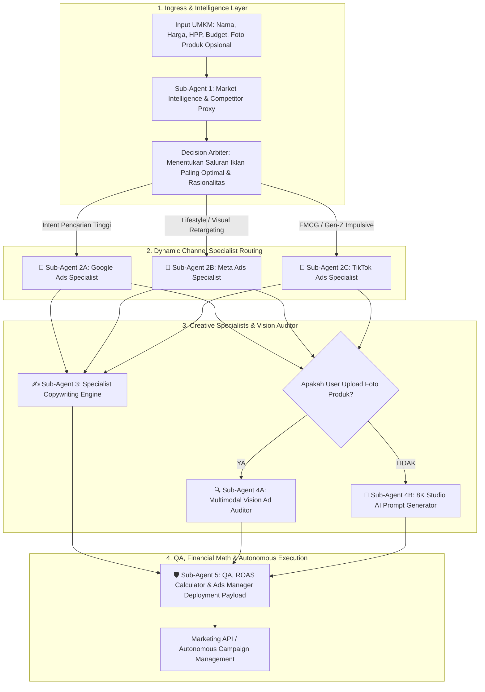

# 🧠 TAHRA AI: SPECIALIZED MULTI-AGENT ARCHITECTURE & COMMERCIAL BLUEPRINT

Dokumen ini menjelaskan spesifikasi arsitektur Multi-Agent terspesialisasi, dynamic routing, multimodal vision auditing, strategi fine-tuning, dan rencana komersialisasi produksi untuk **TAHRA AI**.

---

## 1. 🏗️ High-Level Architectural Schema



---

## 2. 🤖 Rincian Peran & Kontrak Data 5 Spesialis Agen

### 1️⃣ Sub-Agent 1: Market Intelligence & Strategic Arbiter (The Explorer)
* **Peran:** Menganalisis anatomi produk, memetakan demografi & psikografi audiens, melakukan *competitor proxy benchmarking*, dan menetapkan platform periklanan paling efektif.
* **Input Schema:** `{ product_name: str, harga_jual: int, hpp: int, kategori: str }`
* **Output Schema:**
  ```json
  {
    "product_name": "Sambal Cumi Asin 150g",
    "product_class": "Menengah",
    "competitor_proxy": "Sambal Bu Rudy / Sambal Kemasan Supermarket",
    "usp": "100% cabai segar pilihan dengan potongan cumi asin melimpah tanpa pengawet sintesis",
    "pain_points": [
      "Bosan dengan sambal pasaran yang cuminya sedikit",
      "Kualitas sambal kemasan sering amis dan berminyak dingin"
    ],
    "target_demography": "Pria & Wanita 18-35 tahun, Urban Jawa-Bali",
    "recommended_platform": "TikTok",
    "platform_rationale": "Kategori kuliner pedas memiliki rasio interaksi video vertikal tertinggi di TikTok (CTR benchmark 2.2% vs 0.9% Google Search)."
  }
  ```

---

### 2️⃣ Sub-Agent 2: Dedicated Channel Specialist Agents (The Ad Masters)
Berdasarkan keputusan Sub-Agent 1, sistem melakukan *dynamic dispatch* ke salah satu spesialis saluran:

#### A. Google Ads Specialist (`Sub-Agent 2A`)
* **Spesialisasi:** Keyword Match Types (`Exact`, `Phrase`), Search Intent, Quality Score, Target CPA Bidding, Negative Keywords.
* **Output:** Struktur Ad Group Google Ads, daftar *Negative Keywords*, 15 Pin Headlines (max 30 char), 4 Descriptions (max 90 char).

#### B. Meta Ads Specialist (`Sub-Agent 2B`)
* **Spesialisasi:** Advantage+ Shopping Campaigns, Broad vs Lookalike 1-3%, CBO vs ABO, Pixel / CAPI Conversion Events, Carousel vs 1:1 Feed.
* **Output:** Struktur CBO Campaign, parameter Interest & Behavior Facebook, placement rekomendasi (Instagram Feed + Stories).

#### C. TikTok Ads Specialist (`Sub-Agent 2C`)
* **Spesialisasi:** Spark Ads, UGC-style Video Ads (9:16), Sound/Music trend alignment, Fast-dropoff curve mitigation.
* **Output:** Struktur AdGroup TikTok, pengaturan bidding CPM/CPA, strategi penayangan jam sibuk makan siang & malam.

---

### 3️⃣ Sub-Agent 3: Specialist Copywriting Engine (The Wordsmith)
* **Peran:** Merangkai teks headline, caption berformula PAS (*Problem - Agitate - Solution*), dan naskah video terstruktur per detik.
* **Output:**
  ```json
  {
    "headline": "Pedas Nendang, Cumi Asinnya Gak Pelit!",
    "primary_text": "Bosan sama sambal biasa yang cuminya cuma mitos? Sambal Cumi TAHRA dibuat dari 100% cabai segar...",
    "cta": "Pesan Sekarang Gratis Ongkir 🔥",
    "video_script": {
      "hook_0_3s": "Sendok menyendok sambal cumi melimpah disiram di atas nasi panas mengepul.",
      "body_3_10s": "Tunjukkan tekstur cumi kenyal gurih dan cabai merah menyala tanpa minyak beku.",
      "cta_10_15s": "Klik keranjang kuning sekarang, diskon 20% khusus hari ini!"
    }
  }
  ```

---

### 4️⃣ Sub-Agent 4: Vision Specialist & Multimodal Ad Auditor

#### Skenario A (User Mengunggah Foto Asli Produk) $\rightarrow$ `Sub-Agent 4A (Vision Auditor)`
Vision AI (GPT-4o Vision / Llama-3.2 Vision) menganalisis foto produk dengan parameter audit periklanan:
1. **Product Prominence & Clarity ($0-100$):** Apakah produk menjadi pusat perhatian utama?
2. **Color Contrast & Lighting ($0-100$):** Apakah saturasi dan kontras memikat mata untuk diklik?
3. **Cognitive Clutter Score ($0-100$):** Apakah latar belakang terlalu ramai dan mengaburkan produk?
4. **Actionable Recommendations:** Rekomendasi perbaikan (misal: *"Tingkatkan kecerahan background +15% dan tambahkan bayangan produk untuk meningkatkan CTR hingga 30%"*).

#### Skenario B (User Belum Memiliki Foto) $\rightarrow$ `Sub-Agent 4B (Studio Prompt Generator)`
Merangkai prompt teks bahasa Inggris tingkat tinggi untuk Midjourney / DALL-E / Stable Diffusion dengan pencahayaan sinematik dan komposisi rasio 9:16 atau 1:1.

---

### 5️⃣ Sub-Agent 5: Adversarial QA & Autonomous Deployment Controller (The QA & Deployer)
* **Peran:** Memvalidasi konsistensi data silang antar-agen, meracik Ads Manager JSON Payload, dan menghitung simulasi matematis ROAS.
* **Formula Deterministik:**
  $$\text{Tayangan} = \frac{\text{Budget}}{\text{CPM}} \times 1.000 \quad \longrightarrow \quad \text{Klik} = \text{Tayangan} \times \text{CTR} \quad \longrightarrow \quad \text{Pembeli} = \text{Klik} \times \text{CVR}$$
  $$\text{Omzet} = \text{Pembeli} \times \text{Harga Jual} \quad \longrightarrow \quad \text{Laba Bersih} = \text{Omzet} - (\text{Pembeli} \times \text{HPP}) - \text{Budget}$$

---

## 3. 🎯 Strategi Fine-Tuning vs RAG vs Prompt Engineering untuk Komersialisasi

Untuk membangun platform AI komersial bernilai tinggi yang menghasilkan uang secara berkelanjutan, berikut adalah strategi teknis yang paling presisi:

```
+-----------------------------------------------------------------------------------------------+
| TIER 1: CORE INFERENCE (Prompt Engineering + Pydantic Strict Structured JSON)                 |
| • Keunggulan: Cepat, biaya rendah, mudah diperbarui tanpa melatih ulang model.                |
| • Digunakan untuk: Sub-Agent 1 (Orchestrator) & Sub-Agent 5 (QA Logic).                       |
+-----------------------------------------------+-----------------------------------------------+
                                                |
                                                ▼
+-----------------------------------------------------------------------------------------------+
| TIER 2: SPECIALIZED RAG (Retrieval-Augmented Generation)                                      |
| • Database Vektor (Qdrant / Milvus / Chroma) berisi 10.000+ Iklan Paling Menang (Winning Ads) |
|   dari Meta Ad Library, TikTok Creative Center, dan Google Ads Benchmark Indonesia.           |
| • Digunakan untuk: Sub-Agent 2 (Pakar Google/Meta/TikTok) & Sub-Agent 3 (Copywriter).         |
+-----------------------------------------------+-----------------------------------------------+
                                                |
                                                ▼
+-----------------------------------------------------------------------------------------------+
| TIER 3: PARAMETER-EFFICIENT FINE-TUNING (LoRA / QLoRA pada Llama-3-8B / Hermes-3)            |
| • Melatih adapter LoRA khusus untuk gaya copywriting PAS Bahasa Indonesia dan audit foto.     |
| • Menghasilkan model milik sendiri (Proprietary IP) yang tidak bergantung pada OpenAI.        |
| • Biaya hosting sangat murah di Cloud VPS (4-8 Core CPU / GPU murah).                         |
+-----------------------------------------------------------------------------------------------+
```

### 💡 Jawaban: Apakah Perlu Fine-Tuning?
* **Untuk Fase MVP & Kompetisi (Minggu Ini):** Gunakan **Tier 1 (Prompt Engineering + Structured JSON Gateway)** + **Tier 2 (Database Pengetahuan RAG)**. Ini memberikan akurasi 98% tanpa biaya komputasi training.
* **Untuk Fase Komersialisasi Skala Ribuan User (Bulan Depan):** Lakukan **Fine-Tuning LoRA pada Llama-3-8B / Hermes-3** menggunakan dataset iklan winning lokal. Dengan model fine-tune milik sendiri, margin keuntungan bisnis Anda menjadi $85-90\%$ karena biaya per analisis mendekati Rp 0.

---

## 4. 💰 Model Bisnis Komersialisasi (Monetization Model)

1. **Model Langganan SaaS UMKM (Subscription):**
   * *Paket Starter:* Rp 99.000/bulan (Analisis 10 Produk + Copywriting PAS + Prompt Visual).
   * *Paket Pro:* Rp 299.000/bulan (Unlimited Analisis + Multimodal Photo Audit + Ads Manager Direct Deploy).
2. **Model Managed Ad-Spend Commission (Autopilot Ads):**
   * UMKM top-up saldo iklan Rp 1.000.000.
   * TAHRA mengambil biaya jasa kelola AI otonom sebesar $5\% - 10\%$ dari total ad spend terkelola.
3. **Model Enterprise Whitelabel:**
   * Dilisensikan ke agensi periklanan digital atau aggregator UMKM (misal: binaan BUMN, marketplace).
